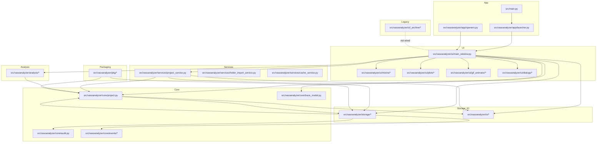

# V3.0 Dependency Map

This map is intended to support safe deprecation and hardening. It highlights allowed dependency directions and areas that must stay UI-free.

## High-level graph (Mermaid)

## Rules / constraints

- Core, storage, io, analysis MUST NOT import UI modules.
- Avoid import-time side effects in core/storage/analysis (no filesystem writes or config mutations on import).
- UI may depend on core/storage/io/analysis/services; services may depend on core/storage/io.
- Packaging (`pkg/*`) is feature-flagged and should remain isolated from UI.

## Safe removal targets once deprecated

- `src/vasoanalyzer/ui/_archive/*`
- `src/vasoanalyzer/ui/protocol_annotation_tool.py`
- Matplotlib main-view renderer toggle (UI only)

## Risky edges to watch

- `core.project` <-> `storage.*` have bidirectional imports (some are local to avoid cycles).
- `ui.main_window` is a nexus of dependencies; changes ripple across most subsystems.
